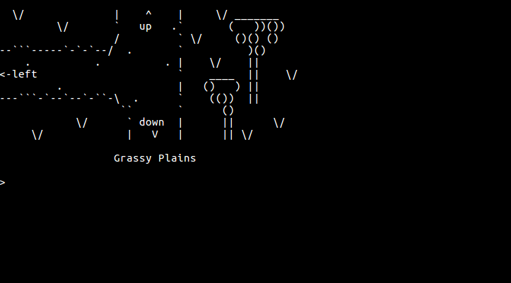

# Father's Day 2020
Island Adventure Game

<br />

## Gameplay



<br />

## About

Every year, I like to program cards for my family for special events, including:

* Birthdays
* Father's Day
* Mother's Day
* _etc._

I don't normally post the cards I program, but I spent more time writing Dad's adventure game
this year, and I am very proud of the final game. I hope that you can also enjoy playing it!
I've removed any personal family references from the code.

<br />

## Compiling

Right now, the game can only be compiled on Linux. However, if you have a Windows computer,
you can compile and run the game using [Windows Subsystem for Linux](https://docs.microsoft.com/en-us/windows/wsl/install-win10)
The game is programmed using Rust, so you will need to install Rust onto your computer.
Follow the directions on how to [Install Rust](https://www.rust-lang.org/tools/install).
Once Rust is installed, you can compile the project using:

```
cargo build
```


The current version of the Rust compiler (`rustc` version 1.44) does not compile the `rl-sys` library
used for the terminal shell. Until the library is patched, you will need to manually edit `rl-sys/src/readline/vars.rs`
and replace:

```rust
/// Get the Readline state flags.
pub fn get_state() -> Option<ReadlineState> {
    ReadlineState::from_bits(rl_readline_state)
}
```

with:

```rust
/// Get the Readline state flags.
pub fn get_state() -> Option<ReadlineState> {
    unsafe { ReadlineState::from_bits(rl_readline_state) }
}
```


<br />

## Running

After the code has compiled, type the following command to run the game:
```
cargo run
```

You play the game using the following terminal commands:
* __go__   &lt;place&gt;               = Move to a new location
* __take__ &lt;item&gt;                = Pick up an item
* __use__  &lt;item&gt;                = Use or interact with an item in the room
* __talk__ &lt;person&gt;              = Speak to a person
* __give__ &lt;person&gt; &lt;item&gt; = Give an item to a person
* __inventory__                        = Print all items in your inventory

Other Commands:
* __clear__ = Redraw the current location
* __help__  = Show the help screen
* __exit__  = End the game
